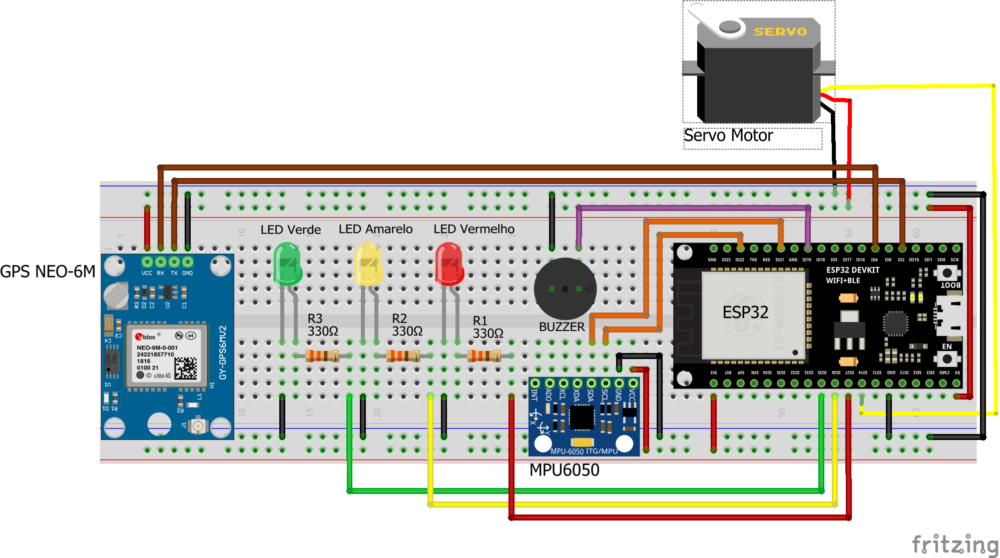

# Firmware Inclinômetro

Projeto que monitora inclinação de um caminhão basculante realizado no ESP32 com comunicação WiFi, Bluetooth e GPS.

## Descrição do Projeto

Este firmware implementa um sistema de monitoramento de inclinação para caminhões basculantes usando ESP32. O sistema possui:

- **Monitoramento de inclinação** usando acelerômetro MPU6050
- **Comunicação WiFi/MQTT** para envio de dados e eventos
- **Comunicação Bluetooth** para configuração via aplicativo
- **GPS** para localização
- **Servo motor** para controle mecânico
- **Sistema de arquivos SPIFFS** para armazenamento de configurações
- **Sinalização** visual e sonora

## Estrutura do Projeto

O projeto está organizado com as seguintes bibliotecas principais:

- `lib/accelerometer/` - Controle do sensor MPU6050
- `lib/bluetooth/` - Comunicação Bluetooth
- `lib/wifi/` - Conexão WiFi
- `lib/gps/` - Módulo GPS
- `lib/configs_manager/` - Gerenciamento de configurações
- `lib/http_communication/` - Montagem de payloads e consulta de configurações HTTP
- `lib/mqtt_communication/` - Publicação de dados e eventos via MQTT
- `lib/servo/` - Controle do servo motor
- `lib/signaling/` - Sistema de sinalização

## Pré-requisitos

### Hardware Necessário

- ESP32 Dev Module
- Sensor MPU6050 (acelerômetro/giroscópio)
- Módulo GPS
- Servo motor
- Componentes de sinalização (LEDs, buzzer)

### Software Necessário

- **PlatformIO** (recomendado) 
- **Git** para clonar o repositório

## Configuração do Ambiente

### Instalação PlatformIO

1. **Instale o Visual Studio Code**
2. **Instale a extensão PlatformIO**
3. **Clone o repositório:**
   ```bash
   git clone https://github.com/ICEI-PUC-Minas-EC-TI/pmg-ec-2025-1-p7-iotii-t1-inclinometro.git
   ```
4. **Abra o projeto no PlatformIO**
   - O arquivo `platformio.ini` já contém todas as configurações necessárias

## Circuito

A imagem a seguir mostra o esquema de ligação dos componentes.



## Como Executar o Projeto

### Compilação e Upload

```bash
# Compilar
pio run

# Upload para o dispositivo
pio run --target upload

# Monitorar serial
pio device monitor
```

### Primeira Inicialização

1. **O sistema inicializará automaticamente:**
   - SPIFFS será formatado se necessário
   - Arquivos de configuração serão criados
   - Todas as tarefas serão iniciadas

2. **Configuração via Bluetooth:**
   - Conecte-se ao dispositivo via Bluetooth
   - Use o aplicativo para configurar WiFi e parâmetros de inclinação

3. **Conexão WiFi:**
   - O sistema tentará conectar automaticamente
   - Dados e eventos serão publicados via MQTT
